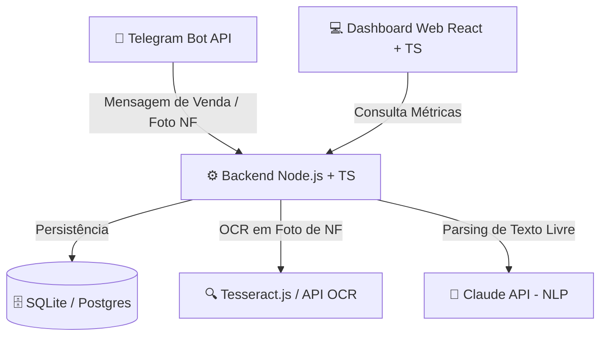
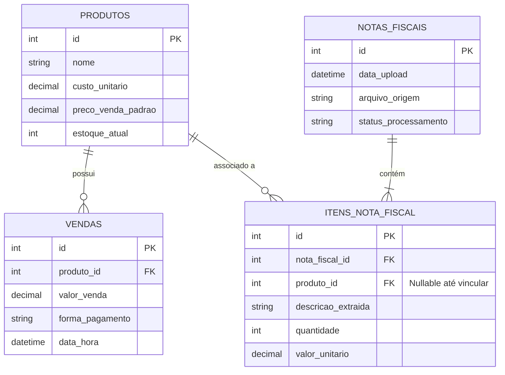

# 💎 App de Gestão para Loja de Semijoias

> **Transformando a rotina de vendas e o controle financeiro de semijoias em uma conversa simples via Telegram.**

[](https://nodejs.org/)
[](https://www.typescriptlang.org/)
[](https://www.docker.com/)
[](LICENSE)

---

## 📖 A História por Trás do Projeto

Era o fim de mais um dia movimentado na loja de semijoias. Peças reluzentes vendidos no balcão, pedidos fechados pelo WhatsApp, pagamentos recebidos via Pix, cartão e dinheiro. No entanto, quando a poeira baixava, vinha a parte mais exaustiva do dia: **o caderno de anotações e a planilha de controle financeiro**.

O proprietário se desdobrava tentando responder às perguntas fundamentais do negócio:
- *"Quanto eu realmente lucrei hoje?"*
- *"Qual foi o custo unitário das peças vendidas versus o valor cobrado?"*
- *"Chegou um novo lote no atacado, mas quanto cada anel ou colar custou individualmente na nota fiscal?"*

Sem um sistema simples e prático, o controle de vendas e custos acabava sendo **manual ou mental**. O resultado? Horas perdidas digitando preços, margens de lucro imprecisas e incerteza sobre a real saúde financeira da loja.

### ✨ A Visão da Solução

E se gerenciar a loja fosse tão fácil e natural quanto enviar uma mensagem no celular? 

Nasce o **App de Gestão da Loja de Semijoias**: um assistente inteligente integrado diretamente ao **Telegram Bot**. 
- **Vendeu uma peça?** Basta enviar uma mensagem rápida: `venda / colar dourado / 45 / pix`.
- **Chegaram novas mercadorias?** Envie uma foto da Nota Fiscal do atacado. O sistema usa **OCR (Reconhecimento Óptico de Caracteres)** para extrair os itens, quantidades e custos automaticamente, atualizando o estoque e o custo médio!
- **Fim do dia?** Um simples `/fechamento` devolve o faturamento total, custo das peças vendidas, lucro bruto, margem percentual e o produto campeão de vendas.

---

## 🎯 Objetivos do Produto

1. **ReduçãoDrástica de Tempo**: Eliminar tarefas repetitivas de anotações e planilhas manuais.
2. **Clareza de Margem Real**: Exibir com precisão o lucro exato ($Venda - Custo$) por dia, semana e por produto.
3. **Automação de Entrada (OCR)**: Eliminar a digitação manual de notas fiscais de atacado através do escaneamento inteligente de notas.
4. **Fechamento Diário Inteligente**: Relatórios consolidados sob demanda ou programados.
5. **Visão Analítica Visual**: Painel web moderno para análise detalhada de tendências e produtos mais lucrativos.

---

## 🚀 Arquitetura & Tecnologias

O sistema é construído sobre uma arquitetura modular, escalável e containerizada com Docker, pronta para evoluir do protótipo até a produção.



### Stack Tecnológica

- **Backend:** Node.js, TypeScript, Express / Telegraf (Telegram Bot API)
- **Banco de Dados:** SQLite (Fases iniciais / Protótipo) com migração facilitada para PostgreSQL / Supabase
- **OCR Engine:** Tesseract.js (Fase 2) evoluindo para APIs especializadas
- **IA / NLP:** API Claude da Anthropic (Fase 3 - interpretação de linguagem natural livre)
- **Frontend / Dashboard:** React + TypeScript (Vite, CSS Moderno / Tailwind)
- **Containerização:** Docker & Docker Compose
- **Padrões de Código:** Clean Code, comentários em português, princípios SOLID.

---

## 📊 Modelo de Dados

O banco de dados foi modelado para garantir rastreabilidade completa entre compras no atacado, estoque e vendas finalizadas:



---

## 💬 Comandos do Bot (Referência Rápida)

| Comando / Envio | Formato / Exemplo | Ação do Sistema |
| :--- | :--- | :--- |
| **Registrar Venda** | `venda / colar dourado / 45 / pix` | Registra a venda, abate estoque e associa custo atual |
| **`/fechamento`** | `/fechamento` | Gera relatório consolidado do dia (Total, Custo, Lucro, Margem, Top Produto) |
| **`/produtos`** | `/produtos` | Lista os produtos cadastrados, preço de custo e estoque atual |
| **`/cadastrar`** | `/cadastrar colar ouro 18k / 20.00` | Cadastra manualmente um novo produto no catálogo |
| **Enviar Foto** | *(Upload de foto de Nota Fiscal)* | Inicia o fluxo OCR de extração de itens e atualização de custos |

---

## 🗓️ Planejamento em Sprints (Roadmap de Desenvolvimento)

Para garantir qualidade, entregas incrementais e testes contínuos, o projeto foi dividido em **6 Sprints**. Cada Sprint possui seu plano validado, suite de testes e entrega via commit no repositório.

### 🏃 Sprint 1: Setup da Estrutura, Docker & Backend Base
- Configuração do ambiente Node.js + TypeScript + Docker / Docker Compose.
- Estruturação da base do banco de dados (SQLite) e repositórios.
- Configuração inicial do Bot do Telegram (Webhook / Polling).
- *Entrega:* Bot respondendo `/ping` e conexão com banco de dados funcional em Docker.

### 🏃 Sprint 2: Registro de Vendas & Cadastro Manual de Produtos
- Implementação das entidades `Produto` e `Venda`.
- Comando de cadastro manual `/cadastrar` e listagem `/produtos`.
- Registro de venda estruturado (`venda / produto / valor / pagamento`).
- *Entrega:* Fluxo completo de vendas com abatimento de estoque e registro no banco.

### 🏃 Sprint 3: Engine do Fechamento Diário (`/fechamento`)
- Cálculo automático de faturamento, custo total das peças vendidas, lucro bruto e margem (%).
- Identificação do produto mais vendido do dia.
- Formatação de relatórios visuais atraentes no Telegram.
- *Entrega:* Comando `/fechamento` pronto com métricas financeiras precisas.

### 🏃 Sprint 4: Processamento OCR de Notas Fiscais (Fase 2)
- Envio de imagens/PDFs de notas fiscais pelo Telegram.
- Integração com engine de OCR (Tesseract.js) para extração de itens, quantidades e valores.
- Interface de associação (Produto do Catálogo ↔ Item da Nota) e atualização do custo médio.
- *Entrega:* Leitura automática de notas fiscais e atualização inteligente de custos.

### 🏃 Sprint 5: Inteligência Natural via Claude API (Fase 3)
- Integração com Claude API para entender mensagens livres (ex: *"vendi um colar por 45 no pix"*).
- Mapeamento dinâmico do texto em JSON estruturado de venda.
- Confirmação e tratamento de ambiguidades com o usuário.
- *Entrega:* Bot 100% conversacional e inteligente.

### 🏃 Sprint 6: Dashboard Web React & Métricas Visuais (Fase 4)
- Desenvolvimento do painel web React + TypeScript.
- Gráficos de lucro por período, histórico de vendas e ranking de rentabilidade.
- Deploy e dockerização completa do ecossistema.
- *Entrega:* Dashboard visual finalizado e sistema integrado.

---

## 🛠️ Como Executar o Projeto com Docker

### Pré-requisitos
- [Docker](https://www.docker.com/) e Docker Compose instalados
- Node.js 18+ (para desenvolvimento local sem Docker)
- Token de Bot do Telegram (obtido via BotFather)

### Passo a Passo

```bash
# 1. Clonar o repositório
git clone https://github.com/jonasferreira-silva1/App-gestao-loja.git
cd App-gestao-loja

# 2. Configurar variáveis de ambiente
cp .env.example .env
# Preencha o TOKEN do Telegram no arquivo .env

# 3. Subir a aplicação via Docker Compose
docker-compose up --build -d

# 4. Verificar os logs
docker-compose logs -f
```

---

## 🧹 Padrões de Código e Clean Code

- **Arquitetura em Camadas:** Separação clara entre Controladores/Handlers, Serviços de Negócio e Repositórios de Dados.
- **Comentários explicativos:** Todos os módulos e funções contêm comentários em português facilitando o entendimento.
- **Tratamento de Erros:** Exceções capturadas e respondidas de forma amigável tanto nos logs quanto no bot.

---

## 📄 Licença

Este projeto está licenciado sob a licença [MIT](LICENSE).

---

*Desenvolvido com foco na eficiência, precisão e facilidade de gestão para o mercado de semijoias.* 💎✨
